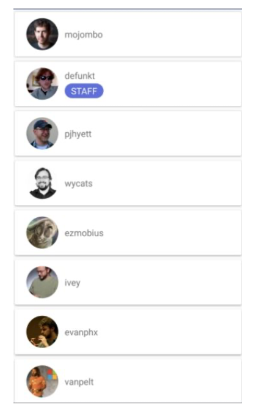

#GitHubTest

## Goal :
    - Implement an Android application including display users from GitHub API

## Develop:
    - Android MVVM architecture
    - Kotlin codebase

## 3rd party libraries
    - Retrofit for GitHub REST API
    - Gson for JSON response handling
    - Koin for Dependency Injection
    - Glide for fetching user avatar into ImageView
    - Rx for composing asynchronous and event

## References:
    - https://developer.github.com/v3/users/#list-users
    - https://developer.github.com/v3/users/#get-a-user

## Features:
    - List UI
        • Show avatar with avatar_url
        • Show login
        • Show badge with checking site_admin
        • Show number of items
        • Paginated -> start with since = 0 and page size = 20

    - The Detail Dialog UI
        • Show close icon
        • Show avatar with avatar_url
        • Show name, bio, login, site_admin, location and blog

